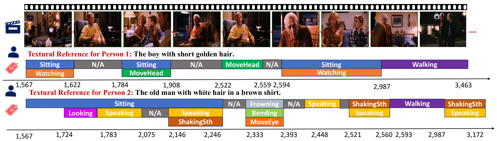

# HopaDIFF: Holistic-Partial Aware Fourier Conditioned Diffusion for Referring Human Action Segmentation in Multi-Person Scenarios
Github repository for referring human action segmentation

Action segmentation is a core challenge in high-level video understanding, aiming to partition untrimmed videos into segments and assign each a label from a predefined action set. Existing methods primarily address single-person activities with fixed action sequences, overlooking multi-person scenarios. In this work, we pioneer textual reference-guided human action segmentation in multi-person settings, where a textual description specifies the target person for segmentation. We introduce the first dataset for Referring Human Action Segmentation, i.e., RHAS133, built from 133 movies and annotated with 137 fine-grained actions with 33h video data, together with textual descriptions for this new task. Benchmarking existing action recognition methods on RHAS133 using VLM-based feature extractors reveals limited performance and poor aggregation of visual cues for the target person. To address this, we propose aholistic-partial aware Fourier-conditioned diffusion framework, i.e., HopaDIFF, leveraging a novel cross-input gate attentional xLSTM to enhance holistic-partial long-range reasoning and a novel Fourier condition to introduce more fine-grained control to improve the action segmentation generation. HopaDIFF achieves state-of-the-art results on RHAS133 in diverse evaluation settings. 

## More Ablation Experiments

**Table: Experimental results with BLIPv2 cross-modal feature extractor and under cross-movie evaluation setting on the RHAS dataset, using frame length 2000.**

| **Method**                  | **Val ACC** | **Val EDIT** | **Val F1@10** | **Val F1@25** | **Val F1@50** | **Test ACC** | **Test EDIT** | **Test F1@10** | **Test F1@25** | **Test F1@50** |
|----------------------------|-------------|--------------|---------------|----------------|----------------|--------------|---------------|----------------|----------------|----------------|
| FACT [[1]](#ref1)          | 38.06       | 0.44         | 75.26         | 73.88          | 70.52          | 36.95        | 0.50          | 73.89          | 72.84          | 70.62          |
| ActDiff [[2]](#ref2)       | 4.59        |  25.48            |  38.96             |     38.59           |  37.66              |   3.00           |   54.96            |        27.41        |       27.08         |       26.14         |
| ASQuery [[3]](#ref3)       |  36.12      |  0.12         |  31.40       |  29.70         | 25.91          |   34.12       |    0.12      |   35.24        |   33.24        |      28.25          |
| LTContent [[4]](#ref4)     | 12.80       | 0.55         |  29.12        |  27.88         | 24.40          | 13.65        |   0.59        |    31.18       |    29.18       |   25.15        |
| RefAtomNet [[5]](#ref5)    |  29.47      |  0.12        |  32.80        |   31.00        | 27.14          |    33.62          |     0.15          |     46.29           |     44.13           |  39.32              |
| **Ours**                   |   59.60          |  35.00            |   94.33            |     92.62           |   88.85             |    62.63          |       90.78        |      94.71          |    93.57            |    91.19            |

---

**References**  
<a name="ref1">[1]</a> Lu et al., FACT, 2024  
<a name="ref2">[2]</a> Liu et al., ActDiff, 2023  
<a name="ref3">[3]</a> Gan et al., ASQuery, 2024  
<a name="ref4">[4]</a> Bahrami et al., LTContent, 2023  
<a name="ref5">[5]</a> Peng et al., RefAtomNet, 2024  

## Dataset Download Links

The dataset is uploading to this google drive link, https://drive.google.com/drive/folders/1061cqqvCdx-GC9a7JqNZ0FoovJqzeYbQ?usp=sharing.

## Setup

* Recommended Environment: Python 3.9.2, Cuda 11.4, PyTorch 1.10.0
* Install dependencies: `pip3 install -r requirements.txt`
* The number of parameters is 415M

## Run

* Generate config files by `python3 default_configs.py`
* Simply run `python3 main.py --config configs/some_config.json --device gpu_id`
* Trained models and logs will be saved in the `result` folder
  

## Action Name Index

| Index | Action          |
|-------|-----------------|
| 1     | arranging       |
| 2     | asking          |
| 3     | beckoning       |
| 4     | bending         |
| 5     | bleeding        |
| 6     | bowing          |
| 7     | breathing       |
| 8     | brushing        |
| 9     | calling         |
| 10    | carrying        |
| 11    | catching        |
| 12    | clapping        |
| 13    | climbing        |
| 14    | closing         |
| 15    | cooking         |
| 16    | coughing        |
| 17    | covering        |
| 18    | crawling        |
| 19    | crossing        |
| 20    | crying          |
| 21    | cutting         |
| 22    | dancing         |
| 23    | dodging         |
| 24    | dragging        |
| 25    | drawing         |
| 26    | drinking        |
| 27    | driving         |
| 28    | dropping        |
| 29    | eating          |
| 30    | entering        |
| 31    | falling         |
| 32    | fixing          |
| 33    | flipping        |
| 34    | flying          |
| 35    | frowning        |
| 36    | gesturing       |
| 37    | getting         |
| 38    | gettingdown     |
| 39    | gettingon       |
| 40    | gettingup       |
| 41    | giving          |
| 42    | grabbing        |
| 43    | handsinpocket   |
| 44    | hanging         |
| 45    | helping         |
| 46    | hitting         |
| 47    | holding         |
| 48    | hugging         |
| 49    | jumping         |
| 50    | kicking         |
| 51    | kissing         |
| 52    | kneeling        |
| 53    | knocking        |
| 54    | laughing        |
| 55    | leaning         |
| 56    | leaving         |
| 57    | lifting         |
| 58    | listening       |
| 59    | litting         |
| 60    | looking         |
| 61    | lookingdown     |
| 62    | lying           |
| 63    | makinghair      |
| 64    | moveeyes        |
| 65    | movehand        |
| 66    | movehead        |
| 67    | movemouth       |
| 68    | moving          |
| 69    | movingbody      |
| 70    | movingonstairs  |
| 71    | no              |
| 72    | nodding         |
| 73    | opening         |
| 74    | picking         |
| 75    | picturing       |
| 76    | playing         |
| 77    | playingmusic    |
| 78    | pointing        |
| 79    | pouring         |
| 80    | pulling         |
| 81    | pushing         |
| 82    | putting         |
| 83    | raising         |
| 84    | reaching        |
| 85    | reading         |
| 86    | receiving       |
| 87    | removing        |
| 88    | riding          |
| 89    | rolling         |
| 90    | rubbing         |
| 91    | running         |
| 92    | sawing          |
| 93    | seaching        |
| 94    | searching       |
| 95    | shaking         |
| 96    | shakingbody     |
| 97    | shocking        |
| 98    | shooting        |
| 99    | shouting        |
| 100   | showing         |
| 101   | sighing         |
| 102   | singing         |
| 103   | sitting         |
| 104   | sittingdown     |
| 105   | slapping        |
| 106   | sleeping        |
| 107   | smearing        |
| 108   | smelling        |
| 109   | smiling         |
| 110   | smoking         |
| 111   | speaking        |
| 112   | squatting       |
| 113   | standing        |
| 114   | standingup      |
| 115   | stopping        |
| 116   | straighteningup |
| 117   | stretching      |
| 118   | struggling      |
| 119   | swimming        |
| 120   | swing           |
| 121   | taking          |
| 122   | takingoff       |
| 123   | talking         |
| 124   | thinking        |
| 125   | throwing        |
| 126   | tidying         |
| 127   | touching        |
| 128   | turning         |
| 129   | walking         |
| 130   | watching        |
| 131   | watering        |
| 132   | waving          |
| 133   | wearing         |
| 134   | wiping          |
| 135   | working         |
| 136   | writing         |
| 137   | yawning         |

##Clusterring of the actions

# Action Clustering

## 🔵 Person-Person Interaction (PPI)

| Index | Action      |
|-------|-------------|
| 2     | asking      |
| 3     | beckoning   |
| 9     | calling     |
| 12    | clapping    |
| 16    | coughing    |
| 41    | giving      |
| 42    | grabbing    |
| 45    | helping     |
| 46    | hitting     |
| 48    | hugging     |
| 51    | kissing     |
| 53    | knocking    |
| 54    | laughing    |
| 58    | listening   |
| 72    | nodding     |
| 78    | pointing    |
| 86    | receiving   |
| 99    | shouting    |
| 100   | showing     |
| 102   | singing     |
| 105   | slapping    |
| 111   | speaking    |
| 123   | talking     |
| 132   | waving      |
| 137   | yawning     |

---

## 🟢 Person-Object Interaction (POI)

| Index | Action         |
|-------|----------------|
| 1     | arranging      |
| 4     | bending        |
| 5     | bleeding       |
| 8     | brushing       |
| 10    | carrying       |
| 11    | catching       |
| 14    | closing        |
| 15    | cooking        |
| 17    | covering       |
| 21    | cutting        |
| 24    | dragging       |
| 25    | drawing        |
| 26    | drinking       |
| 27    | driving        |
| 28    | dropping       |
| 29    | eating         |
| 30    | entering       |
| 32    | fixing         |
| 33    | flipping       |
| 39    | gettingon      |
| 38    | gettingdown    |
| 44    | hanging        |
| 46    | hitting        |
| 47    | holding        |
| 50    | kicking        |
| 57    | lifting        |
| 59    | litting        |
| 63    | makinghair     |
| 73    | opening        |
| 74    | picking        |
| 75    | picturing      |
| 77    | playingmusic   |
| 79    | pouring        |
| 80    | pulling        |
| 81    | pushing        |
| 82    | putting        |
| 85    | reading        |
| 87    | removing       |
| 88    | riding         |
| 89    | rolling        |
| 90    | rubbing        |
| 92    | sawing         |
| 94    | searching      |
| 95    | shaking        |
| 98    | shooting       |
| 106   | sleeping       |
| 107   | smearing       |
| 108   | smelling       |
| 110   | smoking        |
| 114   | standingup     |
| 116   | straighteningup|
| 118   | struggling     |
| 120   | swing          |
| 121   | taking         |
| 122   | takingoff      |
| 125   | throwing       |
| 126   | tidying        |
| 127   | touching       |
| 131   | watering       |
| 133   | wearing        |
| 134   | wiping         |
| 135   | working        |
| 136   | writing        |

---

## 🟠 Person Physical Movements (PPM)

| Index | Action           |
|-------|------------------|
| 6     | bowing           |
| 7     | breathing        |
| 13    | climbing         |
| 18    | crawling         |
| 19    | crossing         |
| 20    | crying           |
| 22    | dancing          |
| 23    | dodging          |
| 31    | falling          |
| 34    | flying           |
| 35    | frowning         |
| 36    | gesturing        |
| 37    | getting          |
| 40    | gettingup        |
| 43    | handsinpocket    |
| 49    | jumping          |
| 52    | kneeling         |
| 55    | leaning          |
| 56    | leaving          |
| 60    | looking          |
| 61    | lookingdown      |
| 62    | lying            |
| 64    | moveeyes         |
| 65    | movehand         |
| 66    | movehead         |
| 67    | movemouth        |
| 68    | moving           |
| 69    | movingbody       |
| 70    | movingonstairs   |
| 71    | no               |
| 76    | playing          |
| 91    | running          |
| 93    | seaching         |
| 96    | shakingbody      |
| 97    | shocking         |
| 101   | sighing          |
| 103   | sitting          |
| 104   | sittingdown      |
| 112   | squatting        |
| 113   | standing         |
| 115   | stopping         |
| 117   | stretching       |
| 119   | swimming         |
| 124   | thinking         |
| 128   | turning          |
| 129   | walking          |
| 130   | watching         |

